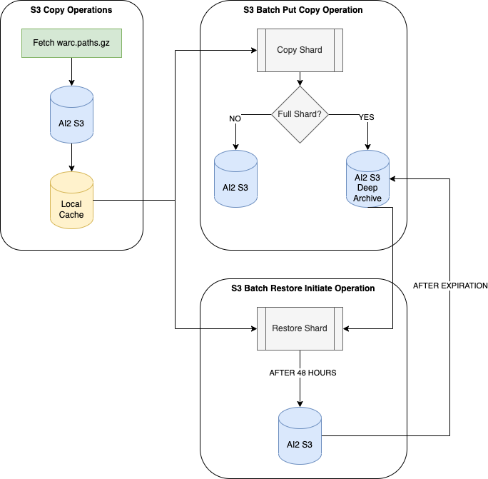
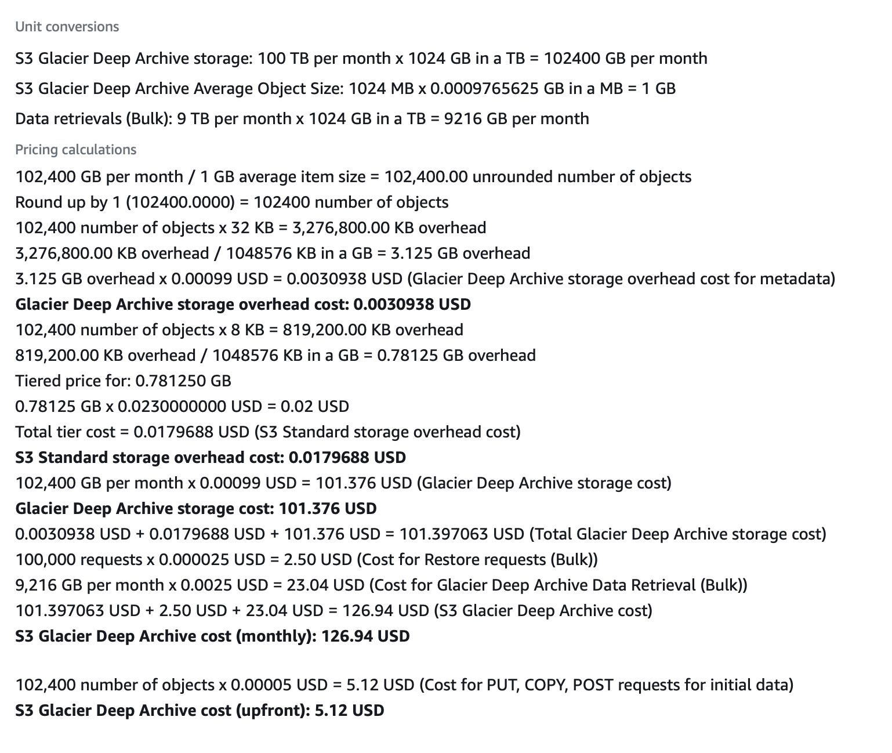

# ccget

This repository contains scripts to archive Common Crawl data on S3 to a bucket on us-east-1 (same region as Common Crawl). Shards are saved to Glacier Deep Archive on S3 (lowest cost storage but with access time and cost penalty). Copy operations are managed with S3's batch operations including object restoration and can all be driven by scripts in this repository.

## Summary of scripts

1. `scripts/create_role.py` -- Create a role capable of executing the batch operation jobs. Most likely this role already exists! So, you should not need to run this script, however, it illustrates the permissions assigned to the role.
1. `scripts/replicate_warc_paths.py` -- Common Crawl's warc.paths.gz files are text files containing the location of all data files in a given shard. Use this script to copy and download these files (~200KB/file; 90 files). This is fast and does not require much storage. Files are NOT re-copied if they exist in a location (unless `ignore_cache` is set). This behavior is probably what you want!
1. `scripts/copy_shard.py` -- Creates and submits an S3 batch operations job to copy from Common Crawl's bucket to a private bucket on S3. It is possible to sub-sample a set of shard files to the S3 standard storage class, however, full copies must go to the Deep Archive storage class and this is enforced in the script.
1. `scripts/restore_shard.py` -- Combines local `warc.paths.gz` files with archived files to pull to standard S3 for a fixed number of days. After time expires files are moved back to Deep Archive. This restoration can take up to 48 hours and MUST go through Bulk restoration mode. Never use Expedited restoration unless it's an emergency as the cost is extremely high.

## About manifest files (generatd by ccget)

A manifest file is created that lists all objects on S3 to be copied or restored depending on your task. This file is very similar to the `warc.paths.gz` files, however, if you use sub-sampling (`-n` parameter) then your batch operation is only applied to files in the manifest. In order to know which files have been archived or restored copy the manifest file locally. This is much faster and cheaper than iterating all files on S3 to see what exists or their restoration status.

The file is a CSV with two columns and no header:

```csv
commoncrawl,crawl-data/CC-MAIN-2015-40/segments/1443736677402.41/warc/CC-MAIN-20151001215757-00091-ip-10-137-6-227.ec2.internal.warc.gz
commoncrawl,crawl-data/CC-MAIN-2015-40/segments/1443737958671.93/warc/CC-MAIN-20151001221918-00124-ip-10-137-6-227.ec2.internal.warc.gz
commoncrawl,crawl-data/CC-MAIN-2015-40/segments/1443737940789.96/warc/CC-MAIN-20151001221900-00179-ip-10-137-6-227.ec2.internal.warc.gz
```

The above example was used in a batch copy job and references specific WARC files in the commoncrawl bucket.

## About batch job report files (generated by S3)

When a batch job completes a report will be generated on S3 that contains the status for each object in the manifest (see previous section). It's a good idea to verify that all items completed in the S3 console, and if any fail you can use the report file to see which failed. The report is a CSV with a similar format to the manifest file (first two columns are Bucket and Key):

```csv
commoncrawl,crawl-data/CC-MAIN-2015-40/segments/1443737940789.96/warc/CC-MAIN-20151001221900-00179-ip-10-137-6-227.ec2.internal.warc.gz,,succeeded,200,,Successful
commoncrawl,crawl-data/CC-MAIN-2015-40/segments/1443736677402.41/warc/CC-MAIN-20151001215757-00091-ip-10-137-6-227.ec2.internal.warc.gz,,succeeded,200,,Successful
commoncrawl,crawl-data/CC-MAIN-2015-40/segments/1443737958671.93/warc/CC-MAIN-20151001221918-00124-ip-10-137-6-227.ec2.internal.warc.gz,,succeeded,200,,Successful
```

This example reports (in many ways) that the specific objects were successfully copied as part of the job. The Job itself specifies the destination bucket (`ai2-russella` in this case) whereas the report shows the source bucket (`commoncrawl`). So, the object key above combined with the destination bucket can be used to retrive or restore (in the case of deep archive) the object.

## Checking the status of an object restoration with the AWS CLI

It can take up to 48 hours to copy an object from deep archive to standard S3 since we use Bulk restoration. To check the status of a single object use the AWS CLI:

```bash
aws s3api head-object \
  --bucket ai2-russella \
  --key crawl-data/CC-MAIN-2015-40/segments/1443737940789.96/warc/CC-MAIN-20151001221900-00179-ip-10-137-6-227.ec2.internal.warc.gz
```

In the result the value of `Restore` has `ongoing-request` as `true`. This means that S3 is actively restoring this object to standard S3 from deep archive.

```json
{
    "AcceptRanges": "bytes",
    "Restore": "ongoing-request=\"true\"",
    "LastModified": "2023-06-23T15:49:29+00:00",
    "ContentLength": 1251691932,
    "ETag": "\"8e41f4fc8a1ce371a2b6fab35f56eb42\"",
    "ContentType": "application/octet-stream",
    "ServerSideEncryption": "AES256",
    "Metadata": {},
    "StorageClass": "DEEP_ARCHIVE"
}
```

When the restore is completed you can use the same command to see the expiration timestamp. A `expiry-date` value will be added to the `Restore` JSON key when the restoration is complete. At that point the object can be accessed like a normal S3 object until it expires.

```json
{
    "AcceptRanges": "bytes",
    "Restore": "ongoing-request=\"false\", expiry-date=\"Mon, 03 Jul 2023 00:00:00 GMT\"",
    "LastModified": "2023-06-23T15:49:29+00:00",
    "ContentLength": 1251691932,
    "ETag": "\"8e41f4fc8a1ce371a2b6fab35f56eb42\"",
    "ContentType": "application/octet-stream",
    "ServerSideEncryption": "AES256",
    "Metadata": {},
    "StorageClass": "DEEP_ARCHIVE"
}
```

Above, you can see the storage class is still `DEEP_ARCHIVE`, however, the presence of the expiry date indicates the object is available for download. Objects that are archived and NOT restored will not have the `Restore` key at all on the response.

## Illustration of archive process



## Cost estimation for using Deep Archive to store data

The cost to store a SINGLE shard of Common Crawl in S3's Glacier Deep Archive is $126.94 / month or $1528.40 / year. This includes ONE restoration to active S3 with transfer costs (but not any on-going S3 storage costs associated). The breakdown is as follows:



Thus, to store 25 shards for a year and access them once will cost around $40,000.

### Cost estimate to run restoration

Issuing a restoration job using `scripts/restore_shard.py` will print an estimate of the cost to both restore the shard files (or the selected subset) and the cost to store the data on S3 standard for the specified number of days. For example:

```bash
python ./scripts/restore_shard.py -s CC-MAIN-2015-40 -n 0 -c ./tmp/cache -b ai2-russella -d 7 --role-name S3BatchOpsRole_CCGET_Test

This restore job is estimated to cost $181.59
...
```

If you don't access your restored files within the specified number of days (`-d` param) then you'll have to pay the restoration fee again! Also, the 7 day window doesn't start until files are restored which can be around 48 hours after starting the restoration job.

## Download the latest collinfo.json

This contains the full list of shards in JSON format. Please note that ARC (very old archive files) are ignored!

[Go here (JSON format)](https://index.commoncrawl.org/collinfo.json)

## Command to create bucket

This CLI command will create a `us-east-1` bucket. Most likely the bucket with Common Crawl data already exists so you should not need to run this!

```bash
aws s3api create-bucket --acl private --bucket ai2-russella --object-ownership BucketOwnerEnforced
```

Location constraint is not specified as the default is `us-east-1` which is the same region as the Common Crawl data.

## AWS Permissions

If you do need to create a role (described above as to why this is unlikely to be the case) then your IAM user will need permission to create roles and policies. Here is an example, generic policy:

```json
{
    "Version": "2012-10-17",
    "Statement": [
        {
            "Effect": "Allow",
            "Action": [
                "iam:AttachRolePolicy",
                "iam:CreateRole",
                "iam:CreatePolicy",
                "iam:PutRolePolicy"
            ],
            "Resource": "*"
        }
    ]
}
```

You will also need permission to pass any created role to S3 batch operations:

```json
{
    "Version": "2012-10-17",
    "Statement": [
        {
            "Effect": "Allow",
            "Action": [
                "iam:PassRole"
            ],
            "Resource": [
                "arn:aws:iam::AWS_ACCOUNT_ID:role/ROLE_NAME"
            ]
        }
    ]
}
```

Replace AWS_ACCOUNT_ID and ROLE_NAME with appropriate values. You will also need permission for `s3:CreateJob`, however, it's likely that you are a power user and already have full access to S3.

## Test Role and Bucket

A test bucket exists within the AllenNLP AWS account: `ai2-russella`. There is also a role with the appropriate permissions that can write and retore to this bucket: `S3BatchOpsRole_CCGET_Test`. Please use these things to test the scripts. But, it's important that a FULL archive is NOT run with the test setup for cost purposes.

## Restore objects to normal S3 PERMANENTLY

Hopefully you never need to do this! If you do, please make sure that you understand that the cost of storage of petabytes of data on S3 standard is significant. For more information on how to retore and object from Glacier Deep Archive permanently see this [Stack Overflow thread](https://stackoverflow.com/questions/51670231/how-do-i-restore-from-aws-glacier-back-to-s3-permanently).

Relevant to this project, you will use the `restore_shard.py` script to restore the files you want to unarchive permanently then follow the steps in the thread above to make an in-place copy with a new storage class.
